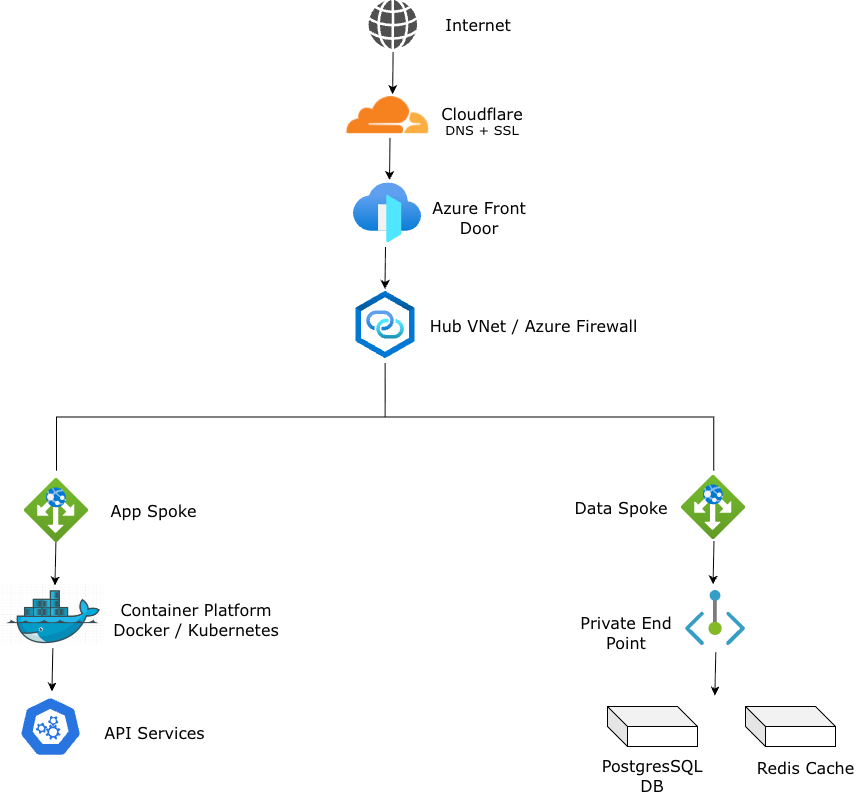

# TracIT Platform Architecture

<p align="center">
  
</p>

**A containerized, multi-service job tracking platform demonstrating a full DevOps and cloud infrastructure stack — from self-hosted Docker to Azure Hub-and-Spoke VNet design.**

[Terraform] [Azure] [Docker] [Cloudflare]  
[](https://terraform.io)  
[](https://azure.microsoft.com)  
[](https://docker.com)  
[](https://cloudflare.com)

---

# Project Overview

TracIT is a containerized multi-service platform built on a Synology NAS and designed for migration to Azure. The project demonstrates how a lightweight self-hosted system can evolve into a production-style cloud architecture using Infrastructure-as-Code, containerized microservices, and enterprise networking patterns.

The platform simulates a real-world DevOps lifecycle:

Self-Hosted Docker → Secure Edge Ingress → Containerized Services → Infrastructure-as-Code → Azure Hub-and-Spoke Cloud Architecture.

The end goal is a **cost-optimized cloud deployment capable of running ephemeral workloads while maintaining enterprise-grade network isolation and security controls.**

---

# Key Architecture Goals

• Demonstrate a full DevOps platform lifecycle from self-hosted infrastructure to cloud deployment.  
• Use containerized microservices to separate frontend, API, automation, and persistence layers.  
• Implement secure ingress using Cloudflare edge protection and reverse proxy routing.  
• Design a cloud-ready topology based on Azure Hub-and-Spoke networking with private endpoints.  
• Manage infrastructure with Terraform and CI/CD pipelines via GitHub Actions.  
• Maintain portability between on-prem Docker environments and Azure container services.

---

# System Architecture

## Self-Hosted Deployment

```
Internet → Cloudflare (DNS + SSL + DDoS) → Synology NAS Firewall + DDNS
        → DSM Reverse Proxy (hostname routing) → Docker Host (tracit_net 172.20.0.0/24)
              ├── Frontend     Next.js      :3000
              ├── Backend API  Node.js      :5200
              ├── Automation   n8n          :5678
              ├── Database     PostgreSQL   :5432  (internal only)
              └── Cache        Redis        :6379  (internal only)
```

**Azure Target (Hub-and-Spoke)**

```
Cloudflare → Azure Front Door (WAF + Global LB)
           → Hub VNet 10.0.0.0/16  [Azure Firewall · Bastion · VPN Gateway]
                  ├── App Spoke 10.1.0.0/16  [Frontend ACI · API ACI · n8n ACI]
                  └── Data Spoke 10.2.0.0/16 [PostgreSQL Flexible · Redis Cache]
                                              (Private Endpoints, no public access)
```

All cross-spoke traffic is force-tunneled through the hub firewall via User-Defined Routes (UDRs). On-premises connectivity to Azure via Site-to-Site VPN for the hybrid migration window.

---

# Design Decisions

## Hub-and-Spoke over Flat VNet
- Single firewall inspection point for all egress
- Mirrors enterprise Cloud Adoption Framework patterns
- Non-overlapping address ranges allow future expansion

## NVA over Azure Firewall
- Azure Firewall ≈ $140/month
- Hardened Ubuntu VM (B1s ≈ $8/month) with `iptables` achieves equivalent routing behavior

## Private Endpoints vs Service Endpoints
- PostgreSQL uses Private Endpoint for maximum isolation
- Key Vault uses Service Endpoint with VNet ACLs for cost efficiency

## Cloudflare Edge Protection
- Hides real origin IP
- Provides DNS, SSL termination, and DDoS protection
- Full (Strict) SSL ensures encryption end-to-end

## Docker Compose over Kubernetes
- Five services on one host does not justify Kubernetes complexity
- Named Docker bridge network (`tracit_net`) provides container DNS

## n8n for Automation
- Visual workflow engine
- Rapid integration capability
- Faster iteration than custom scripts

---

# Lessons Learned

## Asymmetric Routing in Hub-and-Spoke
Hub → Spoke traffic worked but return traffic failed due to missing route tables.

Fix: explicit return routes and verification using Azure Effective Routes.

## Docker DNS Limitations
Service discovery only works on user-defined networks, not the default bridge.

## Azure Subnet Naming Rules
Certain services require reserved subnet names:

AzureFirewallSubnet  
AzureBastionSubnet  
GatewaySubnet

## VNet Address Planning
Overlapping address ranges prevent VNet peering.

Lesson: plan the entire IP space before deployment.

## Cloudflare SSL Modes
Flexible vs Full vs Full-Strict significantly impact origin behavior.

## Docker Volume Loss
`docker compose down -v` deletes named volumes.

Mitigation: nightly automated `pg_dump` backups.

---

## Deployment and Usage

**Local (Docker Compose)**

```bash
git clone https://github.com/yourusername/tracit-platform.git
cd tracit-platform
cp docker/.env.example docker/.env   # fill in secrets
docker compose -f docker/docker-compose.yml up -d
docker compose ps                    # verify all services healthy
```

Services: Frontend `:3000` · API `:5200` · n8n `:5678`

**Azure Infrastructure (Terraform)**

```bash
cd terraform
export TF_VAR_postgres_admin_password="your-password"
terraform init
terraform plan -var="environment=staging" -out=tfplan
terraform apply tfplan
```

**CI/CD Pipeline** — GitHub Actions triggers on push:

| Event | Pipeline |
|---|---|
| Push to any branch | Lint → Unit tests → Docker build → Trivy scan |
| Merge to `main` | Push image to ACR (SHA tag) → Deploy staging → Smoke tests → Manual approval → Deploy prod |

Rollback: redeploy previous image SHA tag from ACR.

---

## Cost Breakdown

**Current (Self-Hosted)**

| Component | Cost |
|---|---|
| Synology NAS power (~15W) | ~$2/mo |
| Domain + Cloudflare Free | ~$1/mo |
| **Total** | **~$3/mo** |

**Azure Target (Basic, Single-Region)**

| Component | SKU | Cost |
|---|---|---|
| NVA (Ubuntu B1s) | Standard_B1s | ~$8/mo |
| Azure Container Instances (×3 services) | 1 vCPU / 1.5GB each | ~$88/mo |
| Azure Database for PostgreSQL | Burstable B1ms | ~$15/mo |
| Azure Cache for Redis | C0 Basic | ~$16/mo |
| Application Gateway | Small | ~$25/mo |
| Azure Container Registry | Basic | ~$5/mo |
| Storage + Networking | — | ~$5/mo |
| **Total (Basic)** | | **~$162/mo** |

**Cost decisions:** NVA instead of Azure Firewall saves ~$132/mo. Key Vault Service Endpoint instead of Private Endpoint saves $7.50/mo. Spot instances for ephemeral compute workloads provide ~90% discount on node costs.

---

## Roadmap

**Part I — Always-On Infrastructure**

- [x] Phase 1: Budget alerts and monthly spend caps
- [x] Phase 2: Hub VNet + hardened Ubuntu NVA + Log Analytics
- [x] Phase 3: Data Spoke VNet + Key Vault (Service Endpoint)
- [ ] Phase 4: Management access — Azure Bastion + dedicated Jumpbox VM *(on hold: regional service degradation)*
- [ ] Phase 5: Azure Policy — allowed VM SKUs, location locks, resource locks on persistent layers
- [ ] Phase 6: Azure Container Registry (Service Endpoint, locked to Compute Spoke subnet)
- [ ] Phase 7: Azure PostgreSQL Flexible Server (Private Endpoint)

**Part II — Ephemeral Compute**

- [ ] Phase 8: Containerize application with Azure SQL driver support
- [ ] Phase 9: K3s cluster on Azure Spot Instances — Master + Worker, outbound via Hub NVA
- [ ] Phase 10: GitHub Actions scheduled CI/CD — deploy at trigger, tear down after run; automatic fallback from Spot to On-Demand on capacity failure

**Part III — Observability and HA**

- [ ] Centralized logging — Azure Monitor + structured JSON from all services
- [ ] Application Insights — distributed tracing across Frontend → API → DB
- [ ] Zone-redundant PostgreSQL (primary + standby across AZs)
- [ ] Azure Front Door replacing App Gateway — WAF + global anycast
- [ ] Terraform remote state — Azure Blob Storage backend with state locking
- [ ] Azure Key Vault for secret rotation (replacing static `.env` secrets)

---

*Infrastructure as Code: [`terraform/`](./terraform/) · Docker Compose: [`docker/`](./docker/) · CI/CD: [`.github/workflows/`](./.github/workflows/)*
